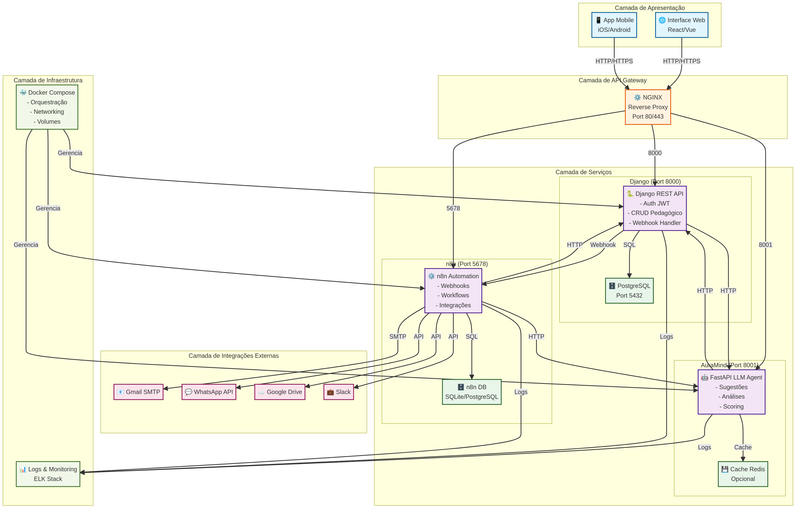
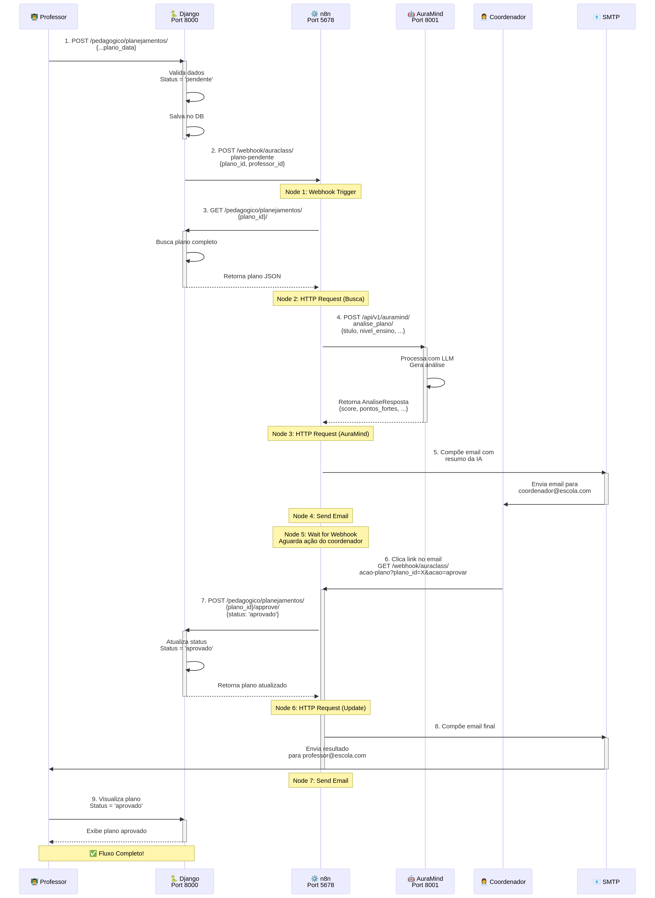
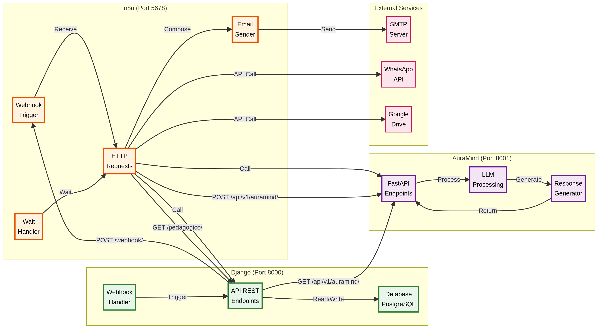

# Arquitetura Visual da Comunicação entre Serviços

## 1. Visão Geral

Este documento detalha a arquitetura de comunicação entre os três principais serviços do sistema AuraClass: **Django**, **AuraMind (FastAPI)** e **n8n**. A arquitetura foi projetada para ser modular, escalável e resiliente, utilizando Docker Compose para orquestração.

## 2. Diagrama de Arquitetura C4

O diagrama C4 abaixo ilustra a estrutura geral do sistema, desde a camada de apresentação até a infraestrutura.



### Principais Componentes:

| Camada | Componente | Descrição |
|---|---|---|
| **Apresentação** | React/Vue, iOS/Android | Interfaces de usuário para web e mobile. |
| **API Gateway** | NGINX | Roteia requisições para os serviços corretos. |
| **Serviços** | Django, AuraMind, n8n | Lógica de negócio, IA e automação. |
| **Banco de Dados** | PostgreSQL, Redis | Armazenamento de dados e cache. |
| **Integrações** | Gmail, WhatsApp, Google Drive | Serviços externos para notificações e arquivos. |
| **Infraestrutura** | Docker, ELK Stack | Orquestração, logs e monitoramento. |

## 3. Diagrama de Sequência: Aprovação de Plano

Este diagrama detalha a sequência de chamadas entre os serviços durante o fluxo de aprovação de um plano pedagógico.



### Etapas do Fluxo:

1.  **Professor submete plano**: `POST` para o Django.
2.  **Django dispara webhook**: `POST` para o n8n.
3.  **n8n busca plano**: `GET` para o Django.
4.  **n8n envia para análise**: `POST` para o AuraMind.
5.  **n8n envia email**: Notifica o coordenador com resumo da IA.
6.  **Coordenador aprova/rejeita**: Clica no link do email, acionando webhook no n8n.
7.  **n8n atualiza status**: `POST` para o Django.
8.  **n8n envia email final**: Notifica o professor.

## 4. Diagrama de Fluxo de Dados

Este diagrama ilustra como os dados fluem entre os diferentes componentes dos serviços.



### Principais Fluxos:

- **Django ↔ PostgreSQL**: Leitura e escrita de dados.
- **Django → n8n**: Disparo de webhooks para iniciar automações.
- **Django ↔ AuraMind**: Chamadas para análise e sugestão de IA.
- **n8n ↔ Django**: Busca de dados e atualização de status.
- **n8n ↔ AuraMind**: Envio de dados para análise.
- **n8n → Serviços Externos**: Envio de emails, mensagens e arquivos.

## 5. Exemplos de Comunicação

### 5.1 Django para n8n (Webhook)

**Cenário**: Professor submete um plano para aprovação.

**Código Django (`pedagogico/views.py`)**:

```python
# Dispara o webhook para o n8n
response = requests.post(
    settings.N8N_WEBHOOK_URL,
    json={
        "plano_id": plano.id,
        "professor_id": plano.professor.id,
        "status": "pendente"
    }
)
```

**n8n (Node 1: Webhook Trigger)**:

- **URL**: `http://localhost:5678/webhook/auraclass/plano-pendente`
- **Payload Recebido**:
  ```json
  {
    "plano_id": 123,
    "professor_id": 45,
    "status": "pendente"
  }
  ```

### 5.2 n8n para AuraMind (Análise IA)

**Cenário**: n8n envia o plano para análise no AuraMind.

**n8n (Node 3: HTTP Request)**:

- **URL**: `http://auramind_agent:8001/api/v1/auramind/analise_plano/`
- **Corpo (JSON)**:
  ```json
  {
    "plano_id": 123,
    "titulo": "Ciclo da Água",
    "nivel_ensino": "4ef",
    "habilidades_bncc": ["EF04CI02"],
    "objetivos_aprendizagem": "Compreender o ciclo da água...",
    "desenvolvimento": "Explicação teórica e prática...",
    "avaliacao": "Quiz e projeto prático"
  }
  ```

**AuraMind (`main.py`)**:

```python
@app.post("/api/v1/auramind/analise_plano/")
async def analisar_plano(requisicao: RequisicaoAnalise):
    # Simula análise com LLM
    resposta = AnaliseResposta(
        plano_id=requisicao.plano_id,
        score_geral=0.88,
        pontos_fortes=[...],
        pontos_revisar=[...],
        sugestoes_melhoria=[...],
        recomendacao_final="APROVADO COM OBSERVAÇÕES"
    )
    return resposta
```

### 5.3 n8n para Django (Atualização de Status)

**Cenário**: Coordenador aprova o plano.

**n8n (Node 6: HTTP Request)**:

- **URL**: `http://web:8000/api/v1/pedagogico/planejamentos/123/approve/`
- **Método**: `POST`
- **Autenticação**: `Bearer <SEU_JWT_TOKEN>`

**Django (`pedagogico/views.py`)**:

```python
@action(detail=True, methods=["post"])
def approve(self, request, pk=None):
    plano = self.get_object()
    plano.status = "aprovado"
    plano.save()
    # Notificar professor
    return Response({"status": "Plano aprovado com sucesso"})
```

## 6. Considerações de Arquitetura

- **Comunicação Síncrona vs. Assíncrona**: A comunicação entre Django e n8n é assíncrona (via webhooks), enquanto a comunicação entre n8n e AuraMind/Django é síncrona (HTTP requests).
- **Segurança**: A comunicação entre os serviços é feita na rede interna do Docker. Para acesso externo, um API Gateway (NGINX) com HTTPS é recomendado.
- **Escalabilidade**: Cada serviço pode ser escalado independentemente. O AuraMind, por ser intensivo em CPU/GPU, pode ser movido para um cluster separado.
- **Resiliência**: O uso de healthchecks no Docker Compose garante que os serviços dependentes só iniciem quando suas dependências estiverem prontas.

## 7. Próximos Passos

- **API Gateway**: Implementar NGINX para roteamento, SSL e rate limiting.
- **Cache**: Adicionar Redis ao AuraMind para cachear respostas de IA.
- **Logs Centralizados**: Configurar ELK Stack para monitoramento.
- **Filas de Mensagens**: Para comunicação assíncrona mais robusta, considerar RabbitMQ ou Kafka.

---

**Data**: 12 de Dezembro de 2025  
**Versão**: 1.1.0  
**Autor**: AuraDev IA
